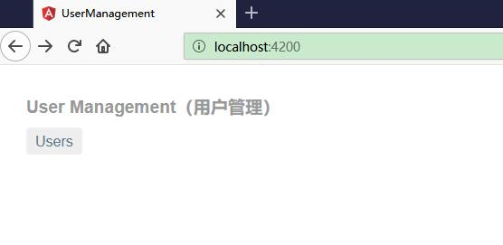
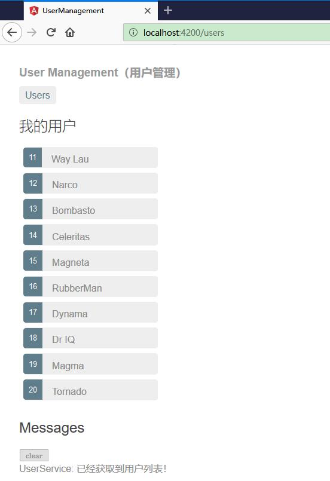
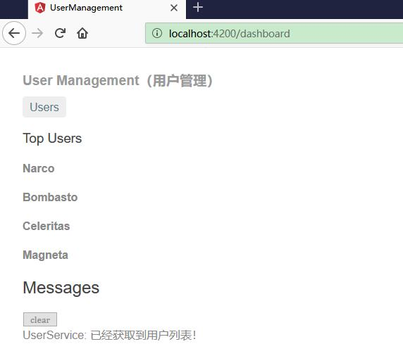
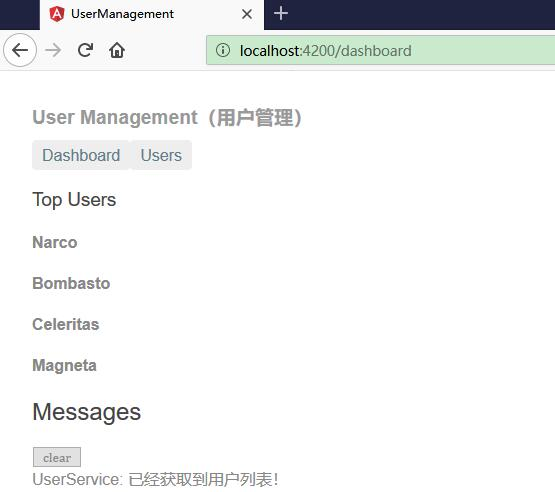

# 添加仪表盘

本章节，我们将实现路由功能。

* 添加一个仪表盘视图。
* 在用户列表和仪表盘视图之间实现导航。

## 添加路由链接

除了把路由的 URL 粘贴到地址栏外，用户应该通过点击链接进行导航。

添加一个 <nav> 元素，并在其中放一个链接 <a> 元素，当点击它时，就会触发一个到 UsersComponent 的导航。 修改过的 AppComponent 模板（src/app/app.component.html ）如下：

```ts
<h1>{{title}}</h1>
<nav>
  <a routerLink="/users">Users</a>
</nav>
<router-outlet></router-outlet>
<app-messages></app-messages>
```

routerLink 属性的值为 "/users"，路由器会用它来匹配出指向 UsersComponent 的路由。 routerLink 是 RouterLink 指令的选择器，它会把用户的点击转换为路由器的导航操作。 它是 RouterModule 中公开的另一个指令。


同时，为了让显示更加美观，我们需要在 src/app/app.component.css 文件中添加如下样式：

```css
h1 {
  font-size: 1.2em;
  color: #999;
  margin-bottom: 0;
}
h2 {
  font-size: 2em;
  margin-top: 0;
  padding-top: 0;
}
nav a {
  padding: 5px 10px;
  text-decoration: none;
  margin-top: 10px;
  display: inline-block;
  background-color: #eee;
  border-radius: 4px;
}
nav a:visited, a:link {
  color: #607d8b;
}
nav a:hover {
  color: #039be5;
  background-color: #cfd8dc;
}
nav a.active {
  color: #039be5;
}
```


## 运行查看效果


执行 `ng serve` 命名以启动应用。访问<http://localhost:4200/>，页面会显示出了应用的标题和指向用户列表的链接，但并没有显示用户列表。





点击这个链接。地址栏变成了 /users， 并且显示出了用户列表。





## 添加仪表盘视图


当有多个视图时，使用路由会更有价值。不过目前还只有一个用户列表视图。

使用 CLI 添加一个 DashboardComponent：

```ts
ng generate component dashboard
```


从控制台可以看到生成了如下文件：

```ts
ng generate component dashboard

CREATE src/app/dashboard/dashboard.component.html (28 bytes)
CREATE src/app/dashboard/dashboard.component.spec.ts (649 bytes)
CREATE src/app/dashboard/dashboard.component.ts (281 bytes)
CREATE src/app/dashboard/dashboard.component.css (0 bytes)
UPDATE src/app/app.module.ts (847 bytes)
```

CLI 生成了 DashboardComponent 的相关文件，并把它声明到 AppModule 中。

### 修改 dashboard.component.html 

修改 dashboard.component.html 如下：

```html
<h3>Top Users</h3>
<div class="grid grid-pad">
  <a *ngFor="let user of users" class="col-1-4">
    <div class="module user">
      <h4>{{user.name}}</h4>
    </div>
  </a>
</div>
```


这个模板用来表示由用户名字链接组成的一个阵列。

* `*ngFor` 复写器为组件的 users 数组中的每个条目创建了一个链接。
* 这些链接被 dashboard.component.css 中的样式格式化成了一些色块。


## 修改 dashboard.component.ts


DashboardComponent 这个类和 UsersComponent 类很像。

```ts
import { Component, OnInit } from '@angular/core';

import { User } from '../user';
import { UserService } from '../user.service';

@Component({
  selector: 'app-dashboard',
  templateUrl: './dashboard.component.html',
  styleUrls: ['./dashboard.component.css']
})
export class DashboardComponent implements OnInit {

  users: User[] = [];

  constructor(private userService: UserService) { }

  ngOnInit() {
    this.getUsers();
  }

  getUsers(): void {
    this.userService.getUsers()
      .subscribe(users => this.users = users.slice(1, 5));
  }

}
```

* 它定义了一个 users 数组属性。
* 它的构造函数希望 Angular 把 UserService 注入到私有的 userService 属性中。
* 在 ngOnInit() 生命周期钩子中调用 getUsers。
* 这个 getUsers 函数 slice 把要显示的用户的数量缩减为四个（取第二、第三、第四和第五）。


## 添加仪表盘到路由

要导航到仪表盘，路由器中就需要一个相应的路由。

把 DashboardComponent 导入到 AppRoutingModule 中：


```ts
import { DashboardComponent }   from './dashboard/dashboard.component';
```

把一个指向 DashboardComponent 的路由添加到 AppRoutingModule.routes 数组中。

```ts
{ path: 'dashboard', component: DashboardComponent },
```


完整代码如下：

```ts
import { NgModule } from '@angular/core';
import { RouterModule, Routes } from '@angular/router';

import { DashboardComponent }   from './dashboard/dashboard.component';
import { UsersComponent } from './users/users.component';

const routes: Routes = [
  { path: 'dashboard', component: DashboardComponent },
  { path: 'users', component: UsersComponent }
];

@NgModule({
  imports: [ RouterModule.forRoot(routes) ],
  exports: [RouterModule]
})
export class AppRoutingModule { }
```


## 添加默认路由

当应用启动时，浏览器的地址栏指向了网站的根路径。 它没有匹配到任何现存路由，因此路由器也不会导航到任何地方。 <router-outlet> 下方是空白的。

要让应用自动导航到这个仪表盘，请把下列路由添加到 AppRoutingModule.Routes 数组中。

```ts
{ path: '', redirectTo: '/dashboard', pathMatch: 'full' },
```

这个路由会把一个与空路径“完全匹配”的 URL 重定向到路径为 '/dashboard' 的路由。

浏览器刷新之后，路由器加载了 DashboardComponent，并且浏览器的地址栏会显示出 /dashboard 这个 URL。效果如下：





完整的代码如下：

```ts
import { NgModule } from '@angular/core';
import { RouterModule, Routes } from '@angular/router';

import { DashboardComponent }   from './dashboard/dashboard.component';
import { UsersComponent } from './users/users.component';

const routes: Routes = [
  { path: '', redirectTo: '/dashboard', pathMatch: 'full' },
  { path: 'dashboard', component: DashboardComponent },
  { path: 'users', component: UsersComponent }
];

@NgModule({
  imports: [ RouterModule.forRoot(routes) ],
  exports: [RouterModule]
})
export class AppRoutingModule { }
```


## 添加仪表盘链接


在页面顶部导航区的增加仪表盘链接。实现各个链接在 DashboardComponent 和 UsersComponent 之间来回导航。

修改 AppComponent 的模板（src/app/app.component.html）：


```ts
<h1>{{title}}</h1>
<nav>
  <a routerLink="/dashboard">Dashboard</a>
  <a routerLink="/users">Users</a>
</nav>
<router-outlet></router-outlet>
<app-messages></app-messages>
```

刷新浏览器，你就能通过点击这些链接在这两个视图之间自由导航了。


