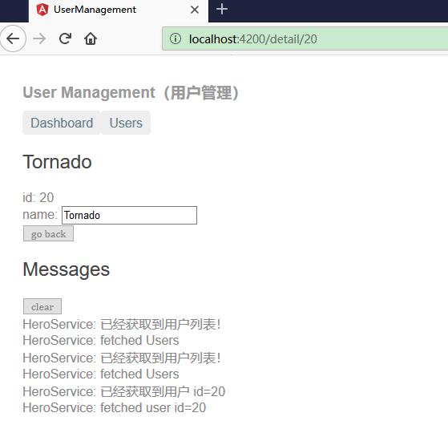

# 使用 HTTP

在本章节中，我们将会使用 Angular 的 HttpClient，来实现 HTTP 服务的调用。

## 启用 HTTP 服务

HttpClient 是 Angular 通过 HTTP 与远程服务器通讯的机制。

要让 HttpClient 在应用中随处可用，请打开根模块 AppModule，从 `@angular/common/http` 中导入 HttpClientModule，并把它加入 @NgModule.imports 数组中。

完整代码如下：

```ts
import { BrowserModule } from '@angular/platform-browser';
import { FormsModule } from '@angular/forms'; 
import { HttpClientModule } from '@angular/common/http';
import { NgModule } from '@angular/core';

import { AppComponent } from './app.component';
import { UsersComponent } from './users/users.component';
import { UserDetailComponent } from './user-detail/user-detail.component';
import { MessagesComponent } from './messages/messages.component';
import { AppRoutingModule } from './/app-routing.module';
import { DashboardComponent } from './dashboard/dashboard.component';
import { HttpClientInMemoryWebApiModule } from 'angular-in-memory-web-api';
import { InMemoryDataService }  from './in-memory-data.service';

@NgModule({
  declarations: [
    AppComponent,
    UsersComponent,
    UserDetailComponent,
    MessagesComponent,
    DashboardComponent
  ],
  imports: [
    BrowserModule,
    FormsModule,
    AppRoutingModule,
    HttpClientModule,
    HttpClientInMemoryWebApiModule.forRoot(
      InMemoryDataService, { dataEncapsulation: false }
    )
  ],
  providers: [],
  bootstrap: [AppComponent]
})
export class AppModule { }
```


## 模拟数据服务器

我们将使用[内存 Web API（In-memory Web API）](https://github.com/angular/in-memory-web-api) 来模拟出的远程数据服务器通讯。这个内存 Web API给测试带来了极大的便利，因为我们不用真实的去实现一个 RESTful 服务去提供给 HttpClient 来调用。

这个内存 Web API 模块与 Angular 中的 HTTP 模块无并联系。要使用内存 Web API 模块，需要执行`npm install angular-in-memory-web-api --save`来进行独立安装。安装过程如下：

```ts
npm install angular-in-memory-web-api --save

> node-sass@4.9.2 install D:\workspaceGithub\angular-tutorial\samples\user-management\node_modules\node-sass
> node scripts/install.js

Downloading binary from https://github.com/sass/node-sass/releases/download/v4.9.2/win32-x64-64_binding.node
Cannot download "https://github.com/sass/node-sass/releases/download/v4.9.2/win32-x64-64_binding.node":

connect ETIMEDOUT 54.231.114.146:443

Timed out whilst downloading the prebuilt binary

Hint: If github.com is not accessible in your location
      try setting a proxy via HTTP_PROXY, e.g.

      export HTTP_PROXY=http://example.com:1234

or configure npm proxy via

      npm config set proxy http://example.com:8080

> node-sass@4.9.2 postinstall D:\workspaceGithub\angular-tutorial\samples\user-management\node_modules\node-sass
> node scripts/build.js

Building: D:\Program Files\nodejs\node.exe D:\workspaceGithub\angular-tutorial\samples\user-management\node_modules\node-gyp\bin\node-gyp.js rebuild --verbose --libsass_ext= --libsass_cflags= --libsass_ldflags= --libsass_library=
gyp info it worked if it ends with ok
gyp verb cli [ 'D:\\Program Files\\nodejs\\node.exe',

...

+ angular-in-memory-web-api@0.6.1
added 1 package and removed 61 packages in 132.041s
```

限于篇幅，这里只展示了主要的过程。

**注意**：如果安装过程中有异常，请先执行`npm install -g node-gyp`，且更新 RxJS 到 6.3.2版本。该问题详见<https://github.com/ReactiveX/rxjs/issues/4090>。

**注意**：做了版本号的修改，需要执行下`ng update`来更新依赖。比如：

```ts
ng update
    We analyzed your package.json, there are some packages to update:

      Name                               Version                  Command to update
     --------------------------------------------------------------------------------
      @angular/core                      6.1.0 -> 6.1.6           ng update @angular/core
      rxjs                               6.2.2 -> 6.3.2           ng update rxjs


    There might be additional packages that are outdated.
    Or run ng update --all to try to update all at the same time.
```


**注意**：有时开发者自己去调整版本号是一件复杂的事情，因为不同版本之间的库存在兼容性问题。如果想把所有的依赖都更新到最新的兼容版本，请执行`ng update --all --next --force`。

安装内存 Web API 模块完成之后，就可以在 package.json 中看到该模块的信息：

```ts
  "dependencies": {
    "@angular/animations": "^6.1.0",
    "@angular/common": "^6.1.0",
    "@angular/compiler": "^6.1.0",
    "@angular/core": "^6.1.0",
    "@angular/forms": "^6.1.0",
    "@angular/http": "^6.1.0",
    "@angular/platform-browser": "^6.1.0",
    "@angular/platform-browser-dynamic": "^6.1.0",
    "@angular/router": "^6.1.0",
    "angular-in-memory-web-api": "^0.6.1",
    "core-js": "^2.5.4",
    "rxjs": "^6.3.2",
    "zone.js": "~0.8.26"
  },
  ```


而后在 app.module.ts  中导入 HttpClientInMemoryWebApiModule 和 InMemoryDataService 类：

```ts
import { HttpClientInMemoryWebApiModule } from 'angular-in-memory-web-api';
import { InMemoryDataService }  from './in-memory-data.service';
```


把 HttpClientInMemoryWebApiModule 添加到 @NgModule.imports 数组中（放在 HttpClient 之后）， 然后使用 InMemoryDataService 来配置它:

```ts
HttpClientModule,
HttpClientInMemoryWebApiModule.forRoot(
  InMemoryDataService, { dataEncapsulation: false }
)
```


forRoot() 配置方法接受一个 InMemoryDataService 类（初期的内存数据库）作为参数。
在应用中创建该 InMemoryDataService 类（src/app/in-memory-data.service.ts），内容如下：

```ts
import { InMemoryDbService } from 'angular-in-memory-web-api';

export class InMemoryDataService implements InMemoryDbService {
  createDb() {
    const users = [
        { id: 11, name: 'Way Lau' },
        { id: 12, name: 'Narco' },
        { id: 13, name: 'Bombasto' },
        { id: 14, name: 'Celeritas' },
        { id: 15, name: 'Magneta' },
        { id: 16, name: 'RubberMan' },
        { id: 17, name: 'Dynama' },
        { id: 18, name: 'Dr IQ' },
        { id: 19, name: 'Magma' },
        { id: 20, name: 'Tornado' }
    ];
    return {users};
  }
}
```

InMemoryDataService 替代了 mock-Useres.ts。

等你真实的服务器就绪时，就可以删除这个内存 Web API，该应用的请求就会直接发给真实的服务器。

## 使用 HTTP


修改  UserService （src/app/user.service.ts）

```ts
import { HttpClient, HttpHeaders } from '@angular/common/http';
```


把 HttpClient 注入到构造函数中一个名叫 http 的私有属性中。

```ts
constructor(
  private http: HttpClient,
  private messageService: MessageService) { }
```

保留对 MessageService 的注入。并在 UserService 中添加一个私有的 log 方法中。

```ts
private log(message: string) {
  this.messageService.add(`UserService: ${message}`);
}
```

把服务器上用户数据资源的访问地址定义为 usersURL。

```ts
private usersURL = 'api/users';  // URL to web api
```


## 通过 HttpClient 获取用户

当前的 UserService.getUsers() 使用 RxJS 的 of() 函数来把模拟用户数据返回为 `Observable<User[]>` 格式:

```ts
getUsers(): Observable<User[]> {
    this.messageService.add('UserService: 已经获取到用户列表！');
    return of(USERS);
}
```

把该方法转换成使用 HttpClient 的 get 方法，打印消息的方法也做了重构，使用了 log 方法：

```ts
getUsers(): Observable<User[]> {
  this.log('已经获取到用户列表！');
  return this.http.get<User[]>(this.usersURL);
}
```

刷新浏览器后，用户数据就会从模拟服务器被成功读取。

你用 http.get 替换了 of，没有做其它修改，但是应用仍然在正常工作，这是因为这两个函数都返回了 Observable<User[]>。


## Http 方法返回单个值

所有的 HttpClient 方法都会返回某个值的 RxJS Observable。

通常，Observable 可以在一段时间内返回多个值。 但来自 HttpClient 的 Observable 总是发出一个值，然后结束，再也不会发出其它值。

具体到这次 HttpClient.get 调用，它返回一个 `Observable<User[]>`，顾名思义就是“一个用户数组的可观察对象”。在实践中，它也只会返回一个用户数组。

## HttpClient.get 返回响应数据

HttpClient.get 默认情况下把响应体当做无类型的 JSON 对象进行返回。 如果指定了可选的模板类型 `<User[]>`，就会给返回你一个类型化的对象。

JSON 数据的具体形态是由服务器的数据 API 决定的。 这里我们的 API 会把用户数据作为一个数组进行返回。

其它 API 可能在返回对象中深埋着你想要的数据。 你可能要借助 RxJS 的 map 操作符对 Observable 的结果进行处理，以便把这些数据挖掘出来。比如下面将要讨论的 getUserNo404() 方法中找到一个使用 map 操作符的例子。

## 错误处理

凡事皆会出错，特别是当你从远端服务器获取数据的时候。 UserService.getUsers() 方法应该捕获错误，并做适当的处理。

要捕获错误，你就要使用 RxJS 的 catchError() 操作符来建立对 Observable 结果的处理管道（pipe）。

从 rxjs/operators 中导入 catchError 符号，以及你稍后将会用到的其它操作符。

```ts
import { catchError, map, tap } from 'rxjs/operators';
```

现在，使用 .pipe() 方法来扩展 Observable 的结果，并给它一个 catchError() 操作符。

```ts
getUsers (): Observable<User[]> {
  return this.http.get<User[]>(this.UseresUrl)
    .pipe(
      catchError(this.handleError('getUsers', []))
    );
}

private handleError<T> (operation = 'operation', result?: T) {
  return (error: any): Observable<T> => {
    console.error(error); 
    this.log(`${operation} failed: ${error.message}`);
    return of(result as T);
  };
}
```

catchError() 操作符会拦截失败的 Observable。 它把错误对象传给错误处理器，错误处理器会处理这个错误。

下面的 handleError() 方法会报告这个错误，并返回一个无害的结果（安全值），以便应用能正常工作。

## 深入 Observable

UserService 的方法将会窥探 Observable 的数据流，并通过 log() 函数往页面底部发送一条消息。

它们可以使用 RxJS 的 tap 操作符来实现，该操作符会查看 Observable 中的值，使用那些值做一些事情，并且把它们传出来。 这种 tap 回调不会改变这些值本身。

下面是 getUseres 的最终版本，它使用 tap 来记录各种操作。

```ts
getUsers(): Observable<User[]> {
  this.log('已经获取到用户列表！');
  return this.http.get<User[]>(this.usersURL)
    .pipe(
      tap(Users => this.log('fetched Users')),
      catchError(this.handleError('getUsers', []))
    );
}
```

## 通过 id 获取用户

大多数 web API 都可以通过 api/user/:id 的形式（比如 api/user/:id ）支持根据 id 获取单个对象。修改原有的 UserService.getUser() ：


```ts
getUser(id: number): Observable<User> {
  this.messageService.add(`UserService: 已经获取到用户 id=${id}`);
  return of(USERS.find(user => user.id === id));
}
```

改为：


```ts
getUser(id: number): Observable<User> {
  this.log(`已经获取到用户 id=${id}`);

  const url = `${this.usersURL}/${id}`;
  return this.http.get<User>(url)
    .pipe(
      tap(_ => this.log(`fetched user id=${id}`)),
      catchError(this.handleError<User>(`getUser id=${id}`))
    );
}
```


同时，`import { USERS } from './mock-users';`导入，以及　mock-users.ts　文件都可以删除不用了。


这里和 getUsers() 相比有三个显著的差异。

* 它使用想获取的用户的 id 构建了一个请求 URL。
* 服务器应该使用单个用户作为回应，而不是一个用户数组。
* 所以，getUser 会返回 Observable<User>（“一个可观察的单个用户对象”），而不是一个可观察的用户对象数组。


## 运行查看效果


执行 `ng serve` 命名以启动应用。访问<http://localhost:4200/> 效果如下：



