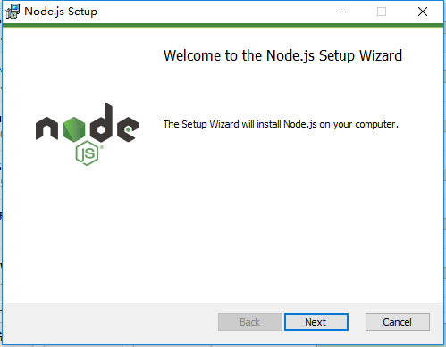
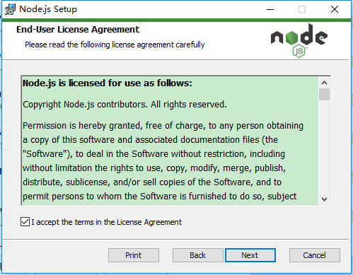
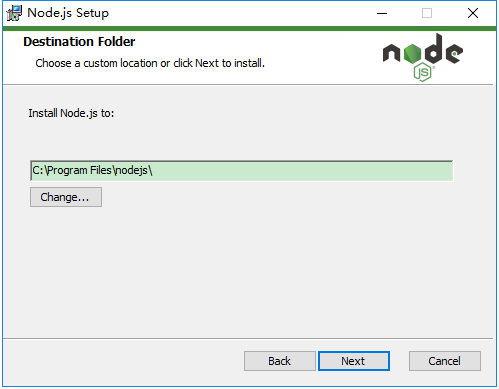
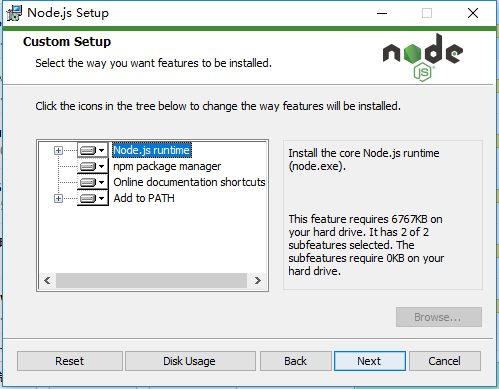
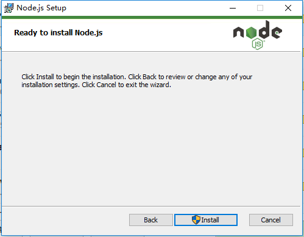
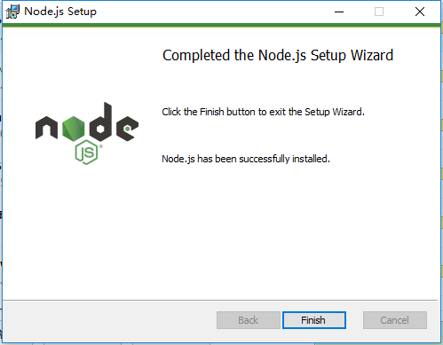
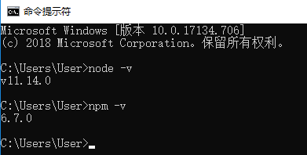

# Angular 开发环境搭建

在开始工作之前，你必须设置好开发环境。

## 安装 Node.js 和 npm


如果你的电脑里没有 Node.js 和 npm，请安装它们。

Node.js 下载地址：<https://nodejs.org/en/download/> 


Node.js 最新版本为 8.11.3（包含了 npm 5.6.0）。为了能够享受最新的 Angular 开发所带来的乐趣，请安装最新版本的 Node.js 和 npm。
















安装完成之后，请先在终端/控制台窗口中运行命令 `node -v` 和 `npm -v`， 来验证一下安装是否正确。





## Node.js 与 npm 的关系

如果你熟悉 Java， 那么你一定知道 Maven。那么 Node.js 与 npm 的关系，就如同 Java 与 Maven 的关系。

简言之，Node.js 与 Java 一样，都是运行应用的平台，都是运行在虚拟机中。Node.js 基于 Google V8 引擎，而 Java 是 JVM。

npm 与 Maven 类似，都是用于依赖管理。前者 npm 管理 js 库，而 Maven 是管理 Java 库。

## Angular CLI

好的工具能让开发更加简单快捷。

Angular CLI 是一个命令行界面工具，它可以创建项目、添加文件以及执行一大堆开发任务，比如测试、打包和发布 Angular 应用。

通过以下方式全局安装 Angular CLI。

```
npm install -g @angular/cli
```

```
D:\workspaceGithub\angular-tutorial>npm install -g @angular/cli
C:\Users\Administrator\AppData\Roaming\npm\ng -> C:\Users\Administrator\AppData\Roaming\npm\node_modules\@angular\cli\bin\ng
npm WARN optional SKIPPING OPTIONAL DEPENDENCY: fsevents@1.2.4 (node_modules\@angular\cli\node_modules\fsevents):
npm WARN notsup SKIPPING OPTIONAL DEPENDENCY: Unsupported platform for fsevents@1.2.4: wanted {"os":"darwin","arch":"any"} (current: {"os":"win32","arch":"x64"})

+ @angular/cli@6.1.1
added 248 packages in 81.427s
```

## 安装 npm 镜像

npm 默认是从国外的源获取和下载包信息，不慢才怪，有时甚至被墙，导致无法正常安装软件。

可以采用国内的 npm 镜像来解决网速慢的问题。

```
npm config set registry=http://registry.npm.taobao.org
```

其他方式，参考<https://waylau.com/faster-npm/>。