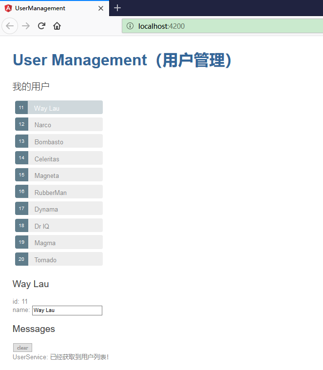

# 添加消息组件

在这一节，我们将：

* 添加一个 MessagesComponent，它在屏幕的底部显示应用中的消息。
* 创建一个可注入的、全应用级别的 MessageService，用于发送要显示的消息。
* 把 MessageService 注入到 UserService 中。
* 当 UserService 成功获取了用户数据时显示一条消息。


## 创建 MessagesComponent

使用 CLI 创建 MessagesComponent。

```ts
ng generate component messages
```

CLI 在 src/app/messages 中创建了组件文件，并且把 MessagesComponent 声明在了 AppModule 中。详细的控制台输出信息如下：

```ts
ng generate component messages

CREATE src/app/messages/messages.component.html (27 bytes)
CREATE src/app/messages/messages.component.spec.ts (642 bytes)
CREATE src/app/messages/messages.component.ts (277 bytes)
CREATE src/app/messages/messages.component.css (0 bytes)
UPDATE src/app/app.module.ts (646 bytes)
```

修改 AppComponent 的模板 app.component.html 来显示所生成的 MessagesComponent：

```html
<h1>{{title}}</h1>
<app-users></app-users>
<app-messages></app-messages>
```

这样，就可以在页面的底部看到来自的 MessagesComponent 的默认内容。


## 创建 MessageService

使用 CLI 在 src/app 中创建 MessageService：

```ts
ng generate service message
```

MessageService 创建完成之后，能够在控制台看到详细的输出信息：

```ts
ng generate service message

CREATE src/app/message.service.spec.ts (380 bytes)
CREATE src/app/message.service.ts (136 bytes)
```

打开 MessageService 的文件 message.service.ts，并把它的内容改成这样：

```ts
import { Injectable } from '@angular/core';
 
@Injectable({
  providedIn: 'root',
})
export class MessageService {
  messages: string[] = [];
 
  add(message: string) {
    this.messages.push(message);
  }
 
  clear() {
    this.messages = [];
  }
}
```

该服务对外暴露了它的 messages 缓存，以及两个方法：

* add() 方法往缓存中添加一条消息；
* clear() 方法用于清空缓存。


## 把 MessageService 注入到 UserService 中

我们将实现一个典型的“服务中的服务”场景： 把 MessageService 注入到 UserService 中，而 UserService 又被注入到了 UsersComponent 中。

重新打开 UserService 文件（hero.service.ts），并且导入 MessageService。


```ts
import { MessageService } from './message.service';
```

修改构造函数 constructor()，添加一个私有的 messageService 属性参数。 Angular 将会在创建 UserService 时把 MessageService 的单例注入到这个属性中：

```ts
constructor(private messageService: MessageService) { }
```

## 从 UserService 中发送一条消息

修改 getUsers 方法，在获取到用户数组时发送一条消息。

```ts
getUsers(): Observable<User[]> {
    this.messageService.add('UserService: 已经获取到用户列表！');
    return of(USERS);
}
```


## 从 UserService 中显示消息

MessagesComponent 可以显示所有消息， 包括当 UserService 获取到用户数据时发送的那条。

打开 MessagesComponent 文件（messages.component.ts），并且导入 MessageService。


```ts
import { MessageService } from '../message.service';
```

修改 MessagesComponent 的构造函数，添加一个 public 的 messageService 属性。 Angular 将会在创建 MessagesComponent 的实例时 把 MessageService 的实例注入到这个属性中。

```ts
constructor(public messageService: MessageService) {}
```

这个 messageService 属性必须是 public 属性，因为你将会在模板中绑定到它。

*提示：Angular 只会绑定到组件的 public 属性。*


## 绑定到 MessageService

把 CLI 生成的 MessagesComponent 的模板（messages.component.html）改成这样：


```ts
<div *ngIf="messageService.messages.length">

  <h2>Messages</h2>
  <button class="clear"
          (click)="messageService.clear()">clear</button>
  <div *ngFor='let message of messageService.messages'> {{message}} </div>

</div>
```

这个模板直接绑定到了组件的 messageService 属性上。

* `*ngIf`只有在有消息时才会显示消息区。
* `*ngFor`用来在一系列 <div> 元素中展示消息列表。
* Angular 的事件绑定把按钮的 click 事件绑定到了 MessageService.clear() 上。

为了让消息会变得好看，需要把样式代码添加到 messages.component.css 中时。这些样式只会作用于 MessagesComponent：

```css
/* MessagesComponent's private CSS styles */
h2 {
  color: red;
  font-family: Arial, Helvetica, sans-serif;
  font-weight: lighter;
}
body {
  margin: 2em;
}
body, input[text], button {
  color: crimson;
  font-family: Cambria, Georgia;
}
 
button.clear {
  font-family: Arial;
  background-color: #eee;
  border: none;
  padding: 5px 10px;
  border-radius: 4px;
  cursor: pointer;
  cursor: hand;
}
button:hover {
  background-color: #cfd8dc;
}
button:disabled {
  background-color: #eee;
  color: #aaa;
  cursor: auto;
}
button.clear {
  color: #888;
  margin-bottom: 12px;
}
```

## 运行查看效果


执行 `ng serve` 命名以启动应用。访问<http://localhost:4200/>滚动到底部，就会在消息区看到来自 HeroService 的消息。点击“清空”按钮，消息区不见了。


效果如下：

